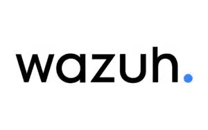
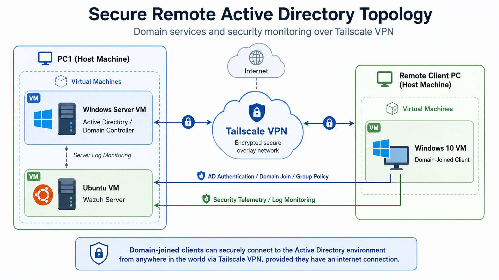

# Enterprise Security Monitoring Lab

**Active Directory • Wazuh SIEM • Threat Detection • Vulnerability Management**

Hands-on enterprise security lab focused on centralized monitoring, endpoint visibility, vulnerability detection, and threat intelligence.

---

## Overview

This project demonstrates the implementation of a Security Information and Event Management (SIEM) environment using Wazuh.

The lab includes:

- Windows Server 2022 running Active Directory Domain Services
- Windows 10 domain-joined client
- Ubuntu Server hosting Wazuh SIEM
- Tailscale VPN for secure connectivity between systems

The environment was designed to demonstrate centralized logging, vulnerability detection, security configuration assessment, file integrity monitoring, malware detection, and threat intelligence integration.

---

## Lab Topology

  

The lab consists of an Active Directory Domain Controller, a Wazuh SIEM server, and a domain-joined Windows endpoint connected through Tailscale.

---

## Technologies Used

  
  
  
  
  
  

- Wazuh SIEM
- Active Directory Domain Services
- Windows Server 2022
- Windows 10
- Ubuntu Server
- Tailscale
- VirusTotal API
- CIS Benchmarks
- MITRE ATT&CK

---

## Features Implemented

### Active Directory

- Domain Controller deployment
- DNS configuration
- Organizational Units
- User and security group management
- Group Policy
- Controlled RDP access

### Security Monitoring

- File Integrity Monitoring (FIM)
- Vulnerability Detection
- Security Configuration Assessment (SCA)
- Malware Detection
- Threat Hunting

### Threat Intelligence

- VirusTotal API integration
- File hash reputation checks
- Alert enrichment

---

## Detection Tests

### File Integrity Monitoring

Wazuh was configured to monitor Windows Desktop and Downloads directories in real time.

File creation and deletion events were successfully detected and displayed within the Wazuh dashboard.

### Vulnerability Detection

An outdated version of 7-Zip was installed on the Windows Server to verify whether Wazuh could identify associated vulnerabilities and CVEs.

### Malware Detection

The EICAR test file was used to validate malware detection using Microsoft Defender and Wazuh.

The resulting Defender security event was collected by Wazuh and generated a high-severity alert.

### VirusTotal Integration

VirusTotal was integrated with Wazuh to enrich File Integrity Monitoring alerts using file hashes.

This allowed suspicious files to be checked against multiple security vendors for additional threat intelligence.

---

## Results

The lab successfully demonstrated:

- Centralized endpoint security monitoring
- Real-time file integrity alerts
- Vulnerability detection
- Malware event collection
- CIS security configuration assessment
- VirusTotal threat-intelligence enrichment
- Active Directory-based access control

---

## Documentation

The full project report is available here:

[View Full Report](docs/Enterprise_Security_Monitoring_Lab.pdf)

## Authors

Joseph Emmanuel  
Varun Senthil Kumar
