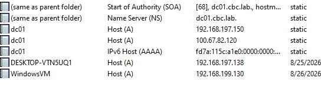

# DNS Configuration

The Windows Server Domain Controller provides DNS services for the `cbc.lab` domain.

Tailscale MagicDNS was configured to use the Domain Controller as the DNS server for the lab domain.

This configuration allows domain-joined systems to resolve Active Directory hostnames and communicate with the Domain Controller across the Tailscale network.
