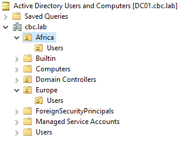

# Active Directory Domain Structure

The lab uses the `cbc.lab` domain with separate Organizational Units for different regions.



```text
cbc.lab
├── Africa
│   └── Users
├── Europe
│   └── Users
├── Computers
└── Domain Controllers
